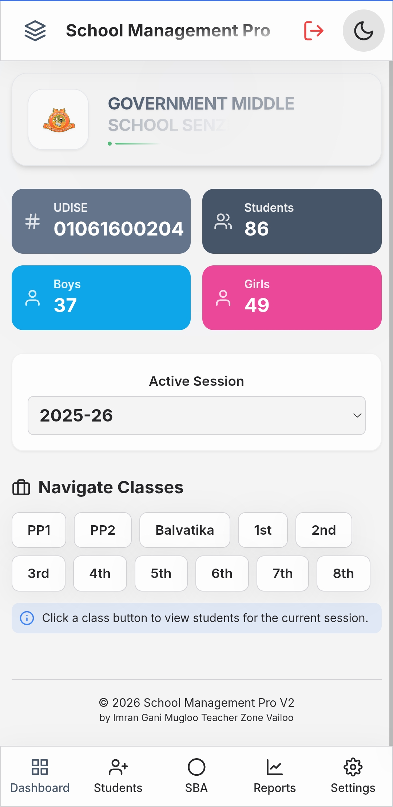
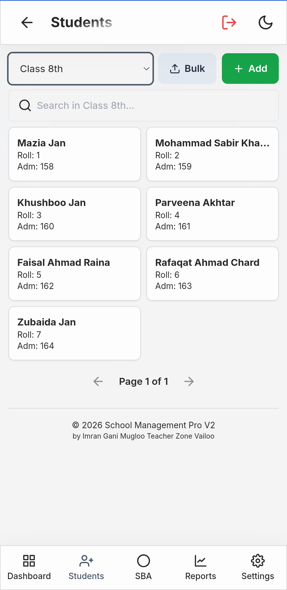
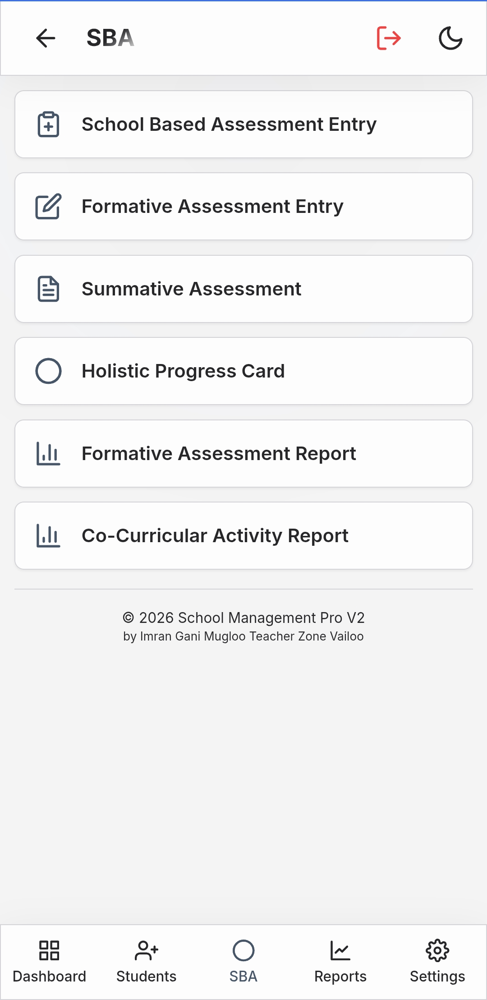
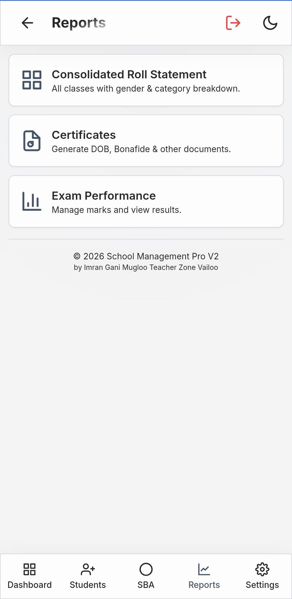
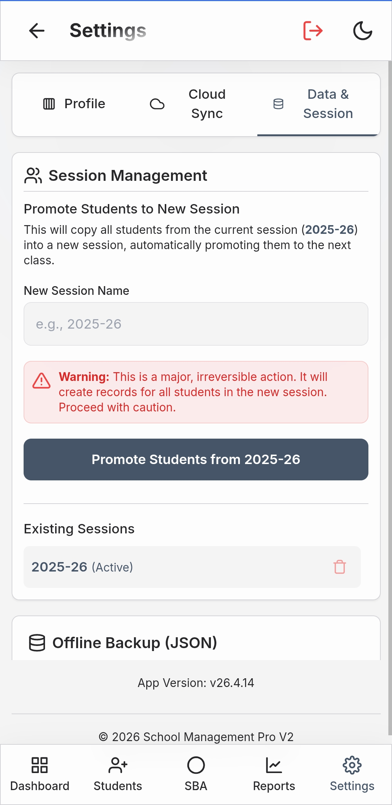

# School Management Pro

Modern Progressive Web App for managing school data, students, classes, and academic records. Built for mobile first usage. Installable as Android app. Works offline.

## Live App
https://imransir09.github.io/SMMS/

## Overview
School Management Pro is a lightweight installable school management system. It provides dashboard analytics, student records, session tracking, and reporting tools in a clean mobile friendly interface.

## Features
- Dashboard with school overview
- Class wise student navigation
- Session based data management
- Student records management
- SBA module
- Reports and analytics
- Settings panel
- Mobile responsive UI
- Installable PWA support
- Offline functionality
- Fast GitHub Pages deployment

## Screenshots

### Dashboard

### Students

### SBA Module

### Reports

### Settings

## Progressive Web App
- Install to home screen
- Fullscreen standalone mode
- Offline caching
- Custom app icons
- Service worker enabled
- Manifest configured
- APK build supported

## Technology Stack
- Vite
- React
- JavaScript
- Progressive Web App
- GitHub Pages

## Installation

Clone repository

git clone https://github.com/ImranSir09/SMMS.git

Install dependencies

npm install

Run development server

npm run dev

## Build

npm run build

## Deployment
Deployment is automated using GitHub Actions. Every push to main branch triggers automatic build and deployment.

Live URL  
https://imransir09.github.io/SMMS/

## Install as App
Open the live URL in Chrome and choose Add to Home Screen.

## Build Android APK
Use PWABuilder  
https://www.pwabuilder.com  
Enter live URL and generate APK.

## Folder Structure

SMMS  
public  
  manifest.json  
  sw.js  
  icon-192.png  
  icon-512.png  
src  
index.html  
vite.config.js  
screenshots  

## Author
Imran Sir

## License
MIT License
